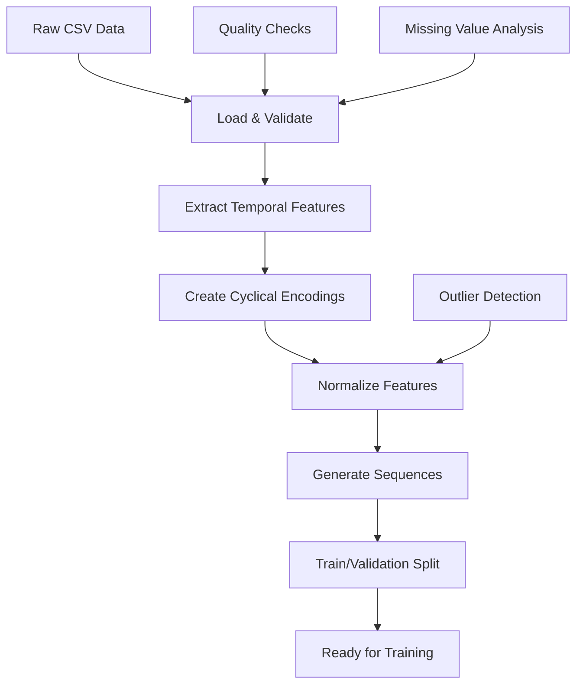

# Data Preprocessing Documentation

## 📊 Data Overview

The weather prediction model uses hourly weather data from New York City containing comprehensive meteorological measurements over a full year (8,760 hourly records).

## 🗂️ Dataset Structure

### Raw Data Schema
| Column | Description | Unit | Range |
|--------|-------------|------|-------|
| `datetime` | Timestamp (hourly) | ISO format | 2020-01-01 to 2020-12-31 |
| `temperature` | Air temperature | °C | -7.84 to 47.57 |
| `humidity` | Relative humidity | % | 25.50 to 100.00 |
| `pressure` | Atmospheric pressure | hPa | 990 to 1040 |
| `wind_speed` | Wind speed | m/s | 0.00 to 46.62 |
| `wind_direction` | Wind direction | degrees | 0 to 360 |
| `precipitation` | Precipitation amount | mm/h | 0.00 to 17.73 |
| `cloud_cover` | Cloud coverage | % | 0 to 100 |
| `uv_index` | UV radiation index | index | 0 to 12 |
| `visibility` | Visibility distance | km | 0.1 to 50 |
| `latitude` | Geographic latitude | decimal degrees | 40.7128 |
| `longitude` | Geographic longitude | decimal degrees | -74.0060 |
| `elevation` | Elevation above sea level | meters | 10 |

### Derived Temporal Features
| Feature | Description | Formula |
|---------|-------------|---------|
| `month` | Extracted month | `datetime.month` |
| `hour` | Extracted hour | `datetime.hour` |
| `day_of_week` | Day of week | `datetime.dayofweek` |

## 🔧 Preprocessing Pipeline

### 1. Data Loading and Validation
```python
def load_and_validate_data(csv_file):
    """Load data with comprehensive validation"""
    df = pd.read_csv(csv_file)
    
    # Validate required columns
    required_columns = [
        'datetime', 'temperature', 'humidity', 'pressure',
        'wind_speed', 'wind_direction', 'precipitation',
        'cloud_cover', 'uv_index', 'visibility',
        'latitude', 'longitude', 'elevation'
    ]
    
    # Check for missing values
    missing_data = df.isnull().sum()
    
    # Validate data ranges
    validate_ranges(df)
    
    return df
```

### 2. Temporal Feature Engineering

#### Cyclical Encoding
Weather patterns are inherently cyclical. To preserve these relationships, temporal features are encoded using sine and cosine transformations:

```python
def create_cyclical_features(df):
    """Create cyclical encodings for temporal features"""
    
    # Monthly cycles (seasonal patterns)
    df['month_sin'] = np.sin(2 * np.pi * df['month'] / 12)
    df['month_cos'] = np.cos(2 * np.pi * df['month'] / 12)
    
    # Daily cycles (diurnal patterns)
    df['hour_sin'] = np.sin(2 * np.pi * df['hour'] / 24)
    df['hour_cos'] = np.cos(2 * np.pi * df['hour'] / 24)
    
    # Weekly cycles
    df['day_sin'] = np.sin(2 * np.pi * df['day_of_week'] / 7)
    df['day_cos'] = np.cos(2 * np.pi * df['day_of_week'] / 7)
    
    # Wind direction cycles
    df['wind_dir_sin'] = np.sin(2 * np.pi * df['wind_direction'] / 360)
    df['wind_dir_cos'] = np.cos(2 * np.pi * df['wind_direction'] / 360)
    
    return df
```

#### Mathematical Rationale
For a cyclical variable with period P:
- `sin_feature = sin(2π * value / P)`
- `cos_feature = cos(2π * value / P)`

This encoding ensures:
1. **Continuity**: Values at boundaries (e.g., Dec-Jan) remain close
2. **Periodicity**: Captures the cyclical nature of time
3. **Smoothness**: Enables gradient-based optimization

### 3. Feature Scaling and Normalization

All features are normalized using MinMaxScaler to ensure:
- **Consistent scales**: All features range from 0 to 1
- **Training stability**: Prevents features with large ranges from dominating
- **Gradient flow**: Improves convergence during training

```python
def normalize_features(df, feature_columns):
    """Normalize features using MinMaxScaler"""
    scalers = {}
    
    for column in feature_columns:
        scaler = MinMaxScaler()
        df[column] = scaler.fit_transform(df[[column]])
        scalers[column] = scaler
    
    return df, scalers
```

### 4. Sequence Generation

#### Sliding Window Approach
Weather prediction requires sequential data. The preprocessing pipeline creates overlapping sequences:

```python
def create_sequences(features, targets, sequence_length=168, prediction_horizon=24):
    """Create time series sequences for training"""
    X, y = [], []
    
    for i in range(len(features) - sequence_length - prediction_horizon + 1):
        # Input sequence: 168 hours of historical data
        sequence = features.iloc[i:i + sequence_length].values
        
        # Target sequence: next 24 hours of weather
        target_start = i + sequence_length
        target_end = target_start + prediction_horizon
        target = targets.iloc[target_start:target_end].values
        
        X.append(sequence)
        y.append(target)
    
    return np.array(X), np.array(y)
```

#### Sequence Specifications
- **Input Length**: 168 hours (7 days)
- **Output Length**: 24 hours (1 day)
- **Overlap**: Sequences overlap by 167 hours
- **Total Sequences**: ~8,500 from 8,760 hourly records

### 5. Data Splitting Strategy

#### Time-Series Aware Splitting
Unlike random splitting, time series requires temporal ordering:

```python
def split_data(X, y, validation_split=0.2):
    """Split data maintaining temporal order"""
    split_index = int(len(X) * (1 - validation_split))
    
    X_train = X[:split_index]
    X_val = X[split_index:]
    y_train = y[:split_index]
    y_val = y[split_index:]
    
    return X_train, X_val, y_train, y_val
```

## 📈 Data Quality Analysis

### Statistical Summary
```python
# Example statistics from NYC weather data
Statistics:
├── Temperature: μ=20.02°C, σ=11.63°C
├── Humidity: μ=75.71%, σ=13.22%
├── Precipitation: μ=0.08mm/h, σ=0.58mm/h
├── Wind Speed: μ=5.17m/s, σ=5.14m/s
└── Missing Values: 0 across all features
```

### Seasonal Patterns Detected
1. **Temperature**: Clear seasonal cycle with peaks in summer
2. **Humidity**: Higher in winter, lower in summer
3. **Precipitation**: Relatively uniform with seasonal variations
4. **Wind Speed**: Higher variability in transitional seasons

## ⚠️ Data Quality Issues Identified

### Current Limitations
1. **Synthetic Data**: The current dataset appears to be synthetic/generated
2. **Limited Geographic Coverage**: Single location (NYC)
3. **Missing Weather Events**: Lack of extreme weather patterns
4. **Overfitting Risk**: Artificial patterns may not generalize

### Recommendations for Improvement
1. **Real Data Sources**: Use actual meteorological data (NOAA, weather APIs)
2. **Multiple Locations**: Include diverse geographic regions
3. **Extended Time Periods**: Multi-year datasets for better pattern learning
4. **Quality Control**: Implement outlier detection and data validation

## 🔄 Preprocessing Workflow



## 📝 Feature Engineering Summary

### Final Feature Set (19 features)
1. **Physical Measurements** (8): temperature, humidity, pressure, wind_speed, precipitation, cloud_cover, uv_index, visibility
2. **Geographic Features** (3): latitude, longitude, elevation  
3. **Temporal Encodings** (8): month_sin, month_cos, hour_sin, hour_cos, day_sin, day_cos, wind_dir_sin, wind_dir_cos

### Target Variables (4)
1. Temperature (°C)
2. Humidity (%)
3. Precipitation (mm/h)
4. Wind Speed (m/s)

## 🚀 Future Enhancements

1. **Advanced Feature Engineering**:
   - Lag features (temperature 1h ago, 6h ago)
   - Moving averages (3h, 6h, 12h windows)
   - Weather derivatives (temperature change rate)

2. **External Data Integration**:
   - Satellite imagery features
   - Ocean temperature data
   - Atmospheric pressure gradients

3. **Quality Improvements**:
   - Real-time data validation
   - Anomaly detection
   - Data imputation strategies

4. **Multi-location Support**:
   - Location-specific scaling
   - Geographic feature embeddings
   - Climate zone categorization
