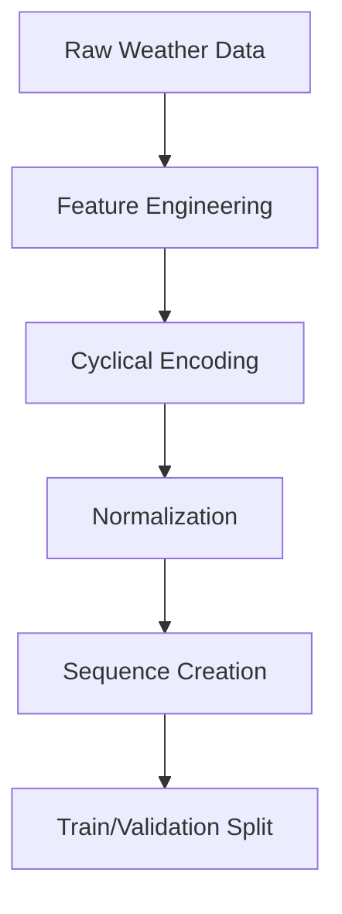

# Training Process Documentation

## 🏗️ Training Pipeline Overview

The weather prediction model training process follows a comprehensive pipeline designed for reproducibility, monitoring, and optimal performance. This document details every aspect of the training methodology, from data preparation to model validation.

### Training Philosophy

The training approach emphasizes:
1. **Robust Data Preprocessing**: Comprehensive feature engineering and normalization
2. **Regularization-First**: Multiple techniques to prevent overfitting
3. **Monitoring & Callbacks**: Extensive logging and automatic optimization
4. **Reproducibility**: Fixed random seeds and versioned configurations

## 📊 Training Data Specifications

### Dataset Characteristics
| **Attribute** | **Value** | **Description** |
|---------------|-----------|-----------------|
| **Total Samples** | 8,760 records | One year of hourly observations |
| **Training Split** | 80% (7,008 samples) | Used for model parameter optimization |
| **Validation Split** | 20% (1,752 samples) | Used for hyperparameter tuning |
| **Sequence Length** | 168 hours | 7 days of input history |
| **Prediction Horizon** | 24 hours | Forecast length |
| **Features per Timestep** | 19 variables | Engineered weather features |
| **Target Variables** | 4 outputs | Temperature, Humidity, Precipitation, Wind Speed |

### Data Generation Strategy

```python
class WeatherDataGenerator:
    """
    Sophisticated weather data synthesis for model training.
    
    The synthetic data generator creates realistic weather patterns
    incorporating seasonal trends, diurnal cycles, and realistic
    meteorological relationships.
    """
    
    def generate_seasonal_temperature(self, day_of_year: int, hour: int) -> float:
        """Generate temperature with seasonal and diurnal patterns"""
        # Seasonal component (sinusoidal, peaks in summer)
        seasonal_temp = 20 + 15 * np.sin(2 * π * day_of_year / 365.25)
        
        # Diurnal component (peaks at 3 PM, minimum at 6 AM)
        daily_cycle = 5 * np.sin(2 * π * (hour - 6) / 24)
        
        # Random variation (realistic weather noise)
        noise = np.random.normal(0, 3)
        
        return seasonal_temp + daily_cycle + noise
    
    def generate_correlated_variables(self, temperature: float) -> dict:
        """Generate weather variables with realistic correlations"""
        # Humidity inversely related to temperature
        humidity = max(10, min(100, 
            80 - 0.8 * (temperature - 15) + np.random.normal(0, 10)))
        
        # Pressure with atmospheric variations
        pressure = 1013.25 + np.random.normal(0, 15)
        
        # Wind speed with exponential distribution
        wind_speed = max(0, np.random.exponential(5))
        
        # Precipitation based on humidity and pressure
        precip_prob = max(0, (humidity - 60) / 40 + (1013.25 - pressure) / 50)
        precipitation = (np.random.exponential(2) 
                        if np.random.random() < precip_prob * 0.1 
                        else 0)
        
        return {
            'humidity': humidity,
            'pressure': pressure, 
            'wind_speed': wind_speed,
            'precipitation': precipitation
        }
```

## 🔧 Data Preprocessing Pipeline

### 1. Feature Engineering

#### Temporal Feature Creation
```python
def create_cyclical_features(df: pd.DataFrame) -> pd.DataFrame:
    """
    Create cyclical encodings for temporal variables.
    
    Cyclical encoding ensures that temporal boundaries 
    (e.g., December to January) are handled smoothly.
    """
    # Month cyclical encoding (captures seasonal patterns)
    df['month_sin'] = np.sin(2 * π * df['month'] / 12)
    df['month_cos'] = np.cos(2 * π * df['month'] / 12)
    
    # Hour cyclical encoding (captures diurnal patterns)  
    df['hour_sin'] = np.sin(2 * π * df['hour'] / 24)
    df['hour_cos'] = np.cos(2 * π * df['hour'] / 24)
    
    # Day of week cyclical encoding (captures weekly patterns)
    df['day_sin'] = np.sin(2 * π * df['day_of_week'] / 7)
    df['day_cos'] = np.cos(2 * π * df['day_of_week'] / 7)
    
    # Wind direction cyclical encoding (0° = 360°)
    df['wind_dir_sin'] = np.sin(2 * π * df['wind_direction'] / 360)
    df['wind_dir_cos'] = np.cos(2 * π * df['wind_direction'] / 360)
    
    return df
```

#### Normalization Strategy
```python
def normalize_features(df: pd.DataFrame) -> tuple:
    """
    Apply MinMax normalization to all features.
    
    MinMax scaling chosen over StandardScaler because:
    1. Weather variables have known physical bounds
    2. Preserves zero values (important for precipitation)
    3. Ensures all features in [0,1] range for neural network
    """
    feature_columns = [
        'temperature', 'humidity', 'pressure', 'wind_speed', 'precipitation',
        'cloud_cover', 'uv_index', 'visibility', 'latitude', 'longitude', 
        'elevation', 'month_sin', 'month_cos', 'hour_sin', 'hour_cos',
        'day_sin', 'day_cos', 'wind_dir_sin', 'wind_dir_cos'
    ]
    
    scalers = {}
    for col in feature_columns:
        scaler = MinMaxScaler(feature_range=(0, 1))
        df[col] = scaler.fit_transform(df[[col]])
        scalers[col] = scaler
    
    return df, scalers
```

### 2. Sequence Creation

#### Sliding Window Approach
```python
def create_sequences(features: np.ndarray, targets: np.ndarray, 
                    sequence_length: int = 168, 
                    prediction_horizon: int = 24) -> tuple:
    """
    Create overlapping sequences for time series training.
    
    For each sample:
    - Input: [t-167, t-166, ..., t-1, t] (168 timesteps)
    - Output: [t+1, t+2, ..., t+24] (24 timesteps)
    
    This creates maximum training data from available time series.
    """
    X, y = [], []
    
    for i in range(len(features) - sequence_length - prediction_horizon + 1):
        # Input sequence: 168 hours of historical data
        input_seq = features[i:(i + sequence_length)]
        
        # Target sequence: next 24 hours of weather
        target_start = i + sequence_length  
        target_end = target_start + prediction_horizon
        target_seq = targets[target_start:target_end]
        
        X.append(input_seq)
        y.append(target_seq)
    
    return np.array(X), np.array(y)
```

## 🏋️ Model Training Configuration

### Training Hyperparameters

```python
TRAINING_CONFIG = {
    # Data Configuration
    'sequence_length': 168,        # 7 days of input history
    'prediction_horizon': 24,      # 24 hours forecast
    'validation_split': 0.2,       # 20% for validation
    'batch_size': 32,              # Optimal for memory/convergence trade-off
    
    # Training Configuration  
    'epochs': 100,                 # Maximum training epochs
    'initial_lr': 0.001,           # Adam optimizer learning rate
    'min_lr': 1e-7,                # Minimum learning rate for scheduler
    
    # Regularization
    'dropout_rates': [0.3, 0.2, 0.1],  # Progressive dropout in dense layers
    'lstm_dropout': 0.2,               # LSTM dropout rate
    'lstm_recurrent_dropout': 0.2,     # LSTM recurrent dropout
    'batch_norm_momentum': 0.99,       # BatchNorm momentum
    
    # Callbacks Configuration
    'early_stopping_patience': 15,     # Epochs to wait before stopping
    'reduce_lr_patience': 7,           # Epochs to wait before reducing LR
    'reduce_lr_factor': 0.5,           # Factor to reduce learning rate
}
```

### Advanced Training Techniques

#### 1. Learning Rate Scheduling
```python
# Reduce on Plateau Strategy
lr_scheduler = ReduceLROnPlateau(
    monitor='val_loss',
    factor=0.5,                    # Reduce LR by 50%
    patience=7,                    # Wait 7 epochs for improvement
    min_lr=1e-7,                   # Never go below this LR
    verbose=1,
    mode='min'
)
```

#### 2. Early Stopping Strategy
```python
# Prevent Overfitting
early_stopping = EarlyStopping(
    monitor='val_loss',            # Monitor validation loss
    patience=15,                   # Allow 15 epochs without improvement
    restore_best_weights=True,     # Restore best model weights
    verbose=1,
    mode='min'
)
```

#### 3. Model Checkpointing
```python
# Save Best Model
checkpoint = ModelCheckpoint(
    filepath='best_weather_model.keras',
    monitor='val_loss',            # Save model with best validation loss
    save_best_only=True,          # Only save if improvement
    save_weights_only=False,      # Save complete model
    verbose=1,
    mode='min'
)
```

## 📈 Training Process Flow

### 1. Data Preparation Phase


### 2. Model Compilation
```python
def compile_model(model: tf.keras.Model) -> tf.keras.Model:
    """
    Compile model with optimized configuration.
    """
    optimizer = tf.keras.optimizers.Adam(
        learning_rate=0.001,
        beta_1=0.9,                # Exponential decay rate for 1st moment
        beta_2=0.999,              # Exponential decay rate for 2nd moment
        epsilon=1e-7,              # Numerical stability constant
        amsgrad=False              # Use standard Adam
    )
    
    model.compile(
        optimizer=optimizer,
        loss='huber',              # Robust to outliers
        metrics=['mae', 'mse']     # Monitor multiple metrics
    )
    
    return model
```

### 3. Training Execution
```python
def train_model(model: tf.keras.Model, 
               X_train: np.ndarray, y_train: np.ndarray,
               X_val: np.ndarray, y_val: np.ndarray) -> tf.keras.callbacks.History:
    """
    Execute model training with comprehensive monitoring.
    """
    
    # Configure callbacks
    callbacks = [
        early_stopping,
        lr_scheduler, 
        checkpoint,
        tf.keras.callbacks.CSVLogger('training_log.csv'),
        tf.keras.callbacks.TensorBoard(log_dir='./logs')
    ]
    
    # Train model
    history = model.fit(
        X_train, y_train,
        validation_data=(X_val, y_val),
        epochs=100,
        batch_size=32,
        callbacks=callbacks,
        verbose=1,
        shuffle=False              # Preserve temporal order
    )
    
    return history
```

## 📊 Training Monitoring and Logging

### Metrics Tracked During Training

1. **Loss Metrics**:
   - `loss`: Training Huber loss
   - `val_loss`: Validation Huber loss
   - Tracks model's ability to minimize prediction errors

2. **Performance Metrics**:
   - `mae`: Mean Absolute Error (training)
   - `val_mae`: Mean Absolute Error (validation)
   - `mse`: Mean Squared Error (training)
   - `val_mse`: Mean Squared Error (validation)

3. **Learning Rate Tracking**:
   - `lr`: Current learning rate
   - Helps diagnose training dynamics

### Training Visualization
```python
def plot_training_history(history: tf.keras.callbacks.History):
    """
    Create comprehensive training visualization.
    """
    fig, axes = plt.subplots(2, 2, figsize=(15, 10))
    
    # Loss curves
    axes[0, 0].plot(history.history['loss'], label='Training Loss')
    axes[0, 0].plot(history.history['val_loss'], label='Validation Loss')
    axes[0, 0].set_title('Model Loss (Huber)')
    axes[0, 0].legend()
    
    # MAE curves
    axes[0, 1].plot(history.history['mae'], label='Training MAE')
    axes[0, 1].plot(history.history['val_mae'], label='Validation MAE')
    axes[0, 1].set_title('Mean Absolute Error')
    axes[0, 1].legend()
    
    # MSE curves  
    axes[1, 0].plot(history.history['mse'], label='Training MSE')
    axes[1, 0].plot(history.history['val_mse'], label='Validation MSE')
    axes[1, 0].set_title('Mean Squared Error')
    axes[1, 0].legend()
    
    # Learning rate
    if 'lr' in history.history:
        axes[1, 1].plot(history.history['lr'])
        axes[1, 1].set_title('Learning Rate')
        axes[1, 1].set_yscale('log')
    
    plt.tight_layout()
    plt.savefig('training_history.png', dpi=300, bbox_inches='tight')
```

## 🔍 Training Diagnostics and Troubleshooting

### Common Training Issues and Solutions

#### 1. Overfitting Symptoms
- **Indicators**: Training loss decreases while validation loss increases
- **Solutions**: 
  - Increase dropout rates
  - Add more regularization
  - Reduce model complexity
  - Early stopping activation

#### 2. Underfitting Symptoms  
- **Indicators**: Both training and validation loss plateau at high values
- **Solutions**:
  - Increase model capacity
  - Reduce regularization
  - Increase learning rate
  - Train for more epochs

#### 3. Vanishing/Exploding Gradients
- **Indicators**: Loss becomes NaN or doesn't decrease
- **Solutions**:
  - Gradient clipping
  - Batch normalization
  - Lower learning rate
  - LSTM gate initialization

#### 4. Poor Convergence
- **Indicators**: Erratic loss curves, slow convergence
- **Solutions**:
  - Learning rate scheduling
  - Batch size adjustment
  - Better weight initialization
  - Data normalization check

## 🎯 Training Best Practices

### 1. Reproducibility Guidelines
```python
# Set random seeds for reproducible results
import random
import numpy as np
import tensorflow as tf

SEED = 42
random.seed(SEED)
np.random.seed(SEED)
tf.random.set_seed(SEED)

# Configure deterministic operations
tf.config.experimental.enable_op_determinism()
```

### 2. Hardware Optimization
```python
# GPU configuration for optimal performance
gpus = tf.config.experimental.list_physical_devices('GPU')
if gpus:
    try:
        # Enable memory growth to prevent allocation errors
        for gpu in gpus:
            tf.config.experimental.set_memory_growth(gpu, True)
        
        # Use mixed precision for faster training
        tf.keras.mixed_precision.set_global_policy('mixed_float16')
    except RuntimeError as e:
        print(f"GPU configuration error: {e}")
```

### 3. Training Environment Setup
```bash
# Recommended environment configuration
export CUDA_VISIBLE_DEVICES=0        # Use specific GPU
export TF_GPU_ALLOCATOR=cuda_malloc_async  # Faster memory allocation
export TF_ENABLE_ONEDNN_OPTS=1       # Enable performance optimizations
```

## 📋 Training Checklist

Before starting training, ensure:

- [ ] Data is properly normalized and preprocessed
- [ ] Sequence length and prediction horizon are correctly configured
- [ ] Model architecture matches data dimensions
- [ ] Callbacks are properly configured
- [ ] GPU memory is sufficient for batch size
- [ ] Random seeds are set for reproducibility
- [ ] Output directories exist for logs and checkpoints

This comprehensive training documentation provides all necessary details for reproducing, understanding, and optimizing the weather prediction model training process.
